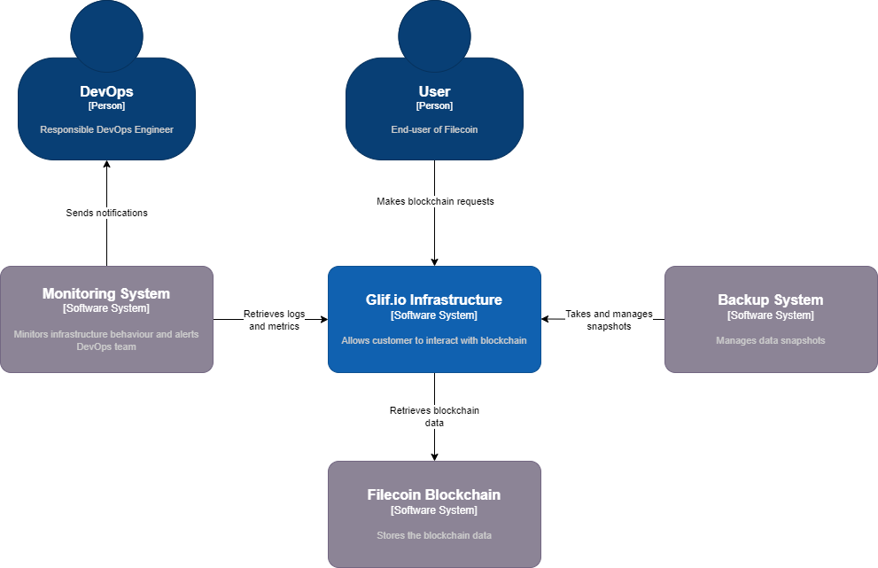
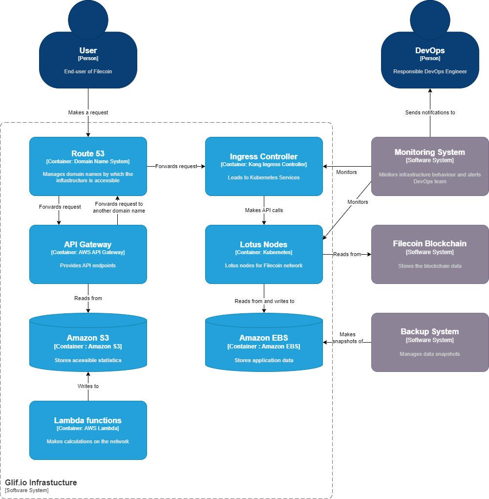

# Filecoin IaC
- [Filecoin IaC](#filecoin-iac)
  - [Summary](#summary)
  - [Installation](#installation)
  - [Structure](#structure)
  - [Architecture](#architecture)
  - [API](#api)
    - [API Endpoints](#api-endpoints)
    - [API Stages](#api-stages)
    - [Ingress rules](#ingress-rules)
      - [Development](#development)
      - [Production](#production)
  - [Backup policies](#backup-policies)
  - [Support tools](#support-tools)
  - [Monitoring](#monitoring)
    - [Uptibe Robot](#uptibe-robot)
    - [Prometheus Stack](#prometheus-stack)

## Summary

This repository provides Infrastructure as Code (IaC) resources to configure and deploy the Filecoin infrastructure.

## Installation

To deploy the infrastructure, do the following:
1. In the [init_configuration](init_configuration/) folder:
    1. Run `terraform init`
    2. Run `terraform apply -var-file=tfvars/filecoin-glif-dev-apn1.tfvars`. That will create the backed S3 and DynamoDB tables for dev environment.
    3. Run `terraform apply -var-file=tfvars/filecoin-glif-mainnet-apn1.tfvars`. That will create the backed S3 and DynamoDB tables for mainnet environment.
2. In the [aws](aws/) folder:
   1. Run `terraform init -backend-config=../filecoin-glif-dev-apn1.hcl` to initialize the module with the backend configured in the previous step.
   2. Run `terraform workspace select filecoin-glif-dev-apn1` to select the `dev` workspace.
   3. Plan and apply the configuration with `-var-file=tfvars/filecoin-glif-dev-apn1.tfvars`.
   4. Repeat those steps for `filecoin-glif-mainnet-apn1` workspace.
3. In the [k8s](k8s/) folder repeat the same actions as in step 2, but the workspace names would be `filecoin-dev-apn1-glif-eks` and `filecoin-mainnet-apn1-glif-eks` respectively.
4. In the [user_management](users_management/) folder initialize the module with `-backend-config=../filecoin-glif-dev-apn1.hcl` only and select `filecoin-glif-dev-apn1` workspace. Then you can apply the config with `-var-file=tfvars/filecoin-users.tfvars`.

## Structure

To help you better navigate through the repository, here's a quck guide.

* [aws](./aws/) - contains the most low-level parts of the infrastructure, including networking services, SSL certificates, the kubernetes cluster configuration and also:
    * [budget.tf](./aws/budget.tf) - AWS Budgets configurations
    * [ecr.tf](./aws/ecr.tf) - container registries for the external plugins, including Fluentbit, CID Checker and external snaphotter
    * [nodegroup_dev.tf](./aws/nodegroup_dev.tf) - node groups configuration for the dev environment
    * [nodegroup_mainnet.tf](./aws/nodegroup_mainnet.tf) - node groups configuration for the mainnet environment
    * [opensearch.tf](./aws/opensearch.tf) - AWS OpenSearch configuration
* [init_configuration](./init_configuration/) - contains resources to spin up Terraform backend with an S3 bucket and a DynamoDB instance.
* [k8s](./k8s/) - contains the most important parts of the infrastructure application-wise, including:
    * AWS API Gateway endpoints and stages configuration
    * Cron jobs for [CID Checker](./k8s/cronjob_cid-checker.tf) and [market deals](./k8s/cronjob_sync_s3_marketdeals.tf)
    * [ebs_csi_driver.tf](./k8s/ebs_csi_driver.tf) - contains resources to setup [Amazon EBS CSI driver](https://docs.aws.amazon.com/eks/latest/userguide/ebs-csi.html)
    * [elb_controller.tf](./k8s/elb_controller.tf) - contains resources to setup [AWS Load Balancer Controller](https://kubernetes-sigs.github.io/aws-load-balancer-controller/)
    * [external-snapshotter.tf](./k8s/external-snapshotter.tf) - contains resources to spin up an external snapshotter ([dev](./k8s/modules_aws_snapshots_dev.tf), [prod](./k8s/modules_aws_snapshots_mainnet.tf))
    * [fluent-bit.tf](./k8s/fluent-bit.tf) - contains resources to spin up [Fluentbit](https://docs.fluentbit.io/manual)
    * [konghq.tf](./k8s/konghq.tf) - contains resources to spin up [Kubernetes Ingress Controller](https://docs.konghq.com/kubernetes-ingress-controller/latest/) ([dev](./k8s/modules-ingress-dev.tf), [prod](./k8s/modules-ingress-mainnet.tf))
    [monitoring.tf](./k8s/monitoring.tf) - contains resources to spin up [Prometheus Stack](https://github.com/prometheus-community/helm-charts/tree/main/charts/kube-prometheus-stack)
* [modules](./modules/) - contains reusable parts of the infrastructure, including:
    * [codebuild](./modules/codebuild/) and [codebuild_multirepositories](./modules/codebuild_multirepositories/) - AWS CodeBuild configurations to leverage CI/CD capabilites
    * [eks_nodegroup](./modules/eks_nodegroup/) - contains resources to spin up a nodegroup whether it's an [on-demand](./modules/eks_nodegroup/launch_templates_ondemand.tf) or a [spot](./modules/eks_nodegroup/launch_templates_spot.tf) instance
* [user_management](./users_management/) - contains resources to spin up IAM user, groups and manage access to the EKS cluster

## Architecture

The most high-level view on the infrastructure is shown on the image below.

More detailed view on how the infrastructure works is shorn on the image below.

## API

### API Endpoints

Requests to Internal Load Balancer are redirectet either to `dev-internal.dev.node.glif.io` or `mainnet-internal.node.glif.io` depending on the environment. What kind of services are listening to such requests is described in ingress rules, refer to [k8s_ingress](#k8s_ingress).

Endpoint | Destination |
| --- | --- | 
| `GET /` | https://node.glif.link |
| `OPTIONS /` | Mock Endpoint |
| `POST /` | Internal Load Balancer |
| `GET /delutedsupply` | https://circulatingsupply.s3.amazonaws.com/delutedsupply |
| `GET /rpc/v0` | https://node.glif.link |
| `POST /rpc/v0` | Internal Load Balancer |
| `OPTIONS /rpc/v0` | Mock Endpoint |
| `GET /rpc/v1` | https://node.glif.link |
| `POST /rpc/v1` | Internal Load Balancer |
| `OPTIONS /rpc/v1` | Mock Endpoint |
| `GET /statecirculatingsupply` | Internal Load Balancer |
| `GET /statecirculatingsupply/fil` | https://circulatingsupply.s3.amazonaws.com/delutedsupply |
| `GET /statecirculatingsupply/fil/v2` | https://circulatingsupply.s3.amazonaws.com/delutedsupply |
| `GET /vmcirculatingsupply` | Internal Load Balancer |
| `ANY /{_next+}` | https://node.glif.link/{_next} |

### API Stages

Here's a short list of domain names that are pointing to API Gateways.

| Domain Name | API Gateway | Stage Name |
| --- | --- | --- |
| calibrationnet.glif.host | dev | calibration |
| mainnet.glif.host | mainnet | mainnet |
| api.node.glif.io | mainnet | mainnet |
| api.calibration.node.glif.io | dev | calibration |
| api.dev.node.glif.io | dev | dev |
| wallaby.node.glif.io | dev | wallaby |

### Ingress rules

#### Development

| Hostname | Path | Match Type | Load Balancer | Namespace | Service |
| --- | --- | --- | --- | --- | --- |
| cid.calibration.node.glif.io | `/` | Prefix | external | default | `cid-checker-frontend:80` |  
| cid.calibration.node.glif.io | `/api/(.*)` | Exact | external | default | `cid-checker-backend:3000` | 
| cid-another.calibration.node.glif.io | `/` | Prefix | external | default | `cid-checker-frontend:80` |  
| cid-another.calibration.node.glif.io | `/api/(.*)` | Exact | external | default | `cid-checker-backend:3000` | 
| calibration.node.glif.io | `/archive/lotus/(.*)` | Exact | external | network | `calibrationapi-archive-node-lotus:1234` | 
| calibration.node.glif.io | `/calibrationapi/ipfs/(.*)` | Exact | external | network | `calibrationapi-ipfs:4001` | 
| calibration.node.glif.io | `/calibrationapi/ipfs/(.*)` | Exact | external | network | `calibrationapi-ipfs:8080` | 
| wallaby.dev.node.glif.io | `/archive/lotus/(.*)` | Exact | external | network | `wallaby-archive-lotus:1234` | 
| wss.dev.node.glif.io | `/apigw/lotus/(.*)` | Exact | external | network | `calibrationapi-lotus` | 
| dev-internal.dev.node.glif.io | `/calibrationapi/lotus/(.*)` | Exact | internal | network | `calibrationapi-lotus:1234` | 
| dev-internal.dev.node.glif.io | `/api-read-dev/cache/(.*)` | Exact | internal | network | `api-read-cache-dev:8080` | 
| dev-internal.dev.node.glif.io | `/wallaby/lotus/(.*)` | Exact | internal | network |  `wallaby-archive-lotus:1234` | 
| wss.wallaby.node.glif.io | `/apigw/wallaby/(.*)` | Exact | external | network | `wallaby-archive-lotus:2346` | 
| monitoring.dev.node.glif.io | `/` | Prefix | external | monitoring | `monitoring-grafana:80` | 

#### Production
| Hostname | Path | Match Type | Load Balancer | Namespace | Service |
| --- | --- | --- | --- | --- | --- |
| cid.node.glif.io | `/` | Prefix | external | default | `cid-checker-frontend:80` |  
| cid.node.glif.io | `/api/(.*)` | Exact | external | default | `cid-checker-backend:3000` | 
| cid-another.node.glif.io | `/` | Prefix | external | default | `cid-checker-frontend:80` |  
| cid-another.node.glif.io | `/api/(.*)` | Exact | external | default | `cid-checker-backend:3000` | 
| node.glif.io | `/space00/lotus/(.*)` | Exact | external | network | `space00-lotus:1234` | 
| node.glif.io | `/space06/lotus/(.*)` | Exact | external | network | `space06-lotus:1234` | 
| node.glif.io | `/space07/lotus/(.*)` | Exact | external | network | `space07-lotus:1234` | 
| node.glif.io | `/space06/cache/(.*)` | Exact | external | network | `space06-cache:8080` | 
| node.glif.io | `/space07/cache/(.*)` | Exact | external | network | `space07-cache:8080` | 
| node.glif.io | `/space00/ipfs/(.*)` | Exact | external | network | `space00-ipfs:4001` | 
| node.glif.io | `/space00/ipfs/(.*)` | Exact | external | network | `space00-ipfs:8080` | 
| wss.node.glif.io | `/apigw/lotus/(.*)` | Exact | external | network | `api-read-master-lotus:2346` | 
| mainnet-internal.node.glif.io | `/api-read/cache/(.*)` | Exact | internal | network | `api-read-v0-cache:8080` | 
| monitoring.node.glif.io | `/` | Prefix | external | monitoring | `monitoring-grafana:80` | 

## Backup policies

The current policies for the snapshots are listed here: [dev](k8s/modules_aws_snapshots_dev.tf), [prod](k8s/modules_aws_snapshots_mainnet.tf).

Snapshotting targets are as follows:
- `calibration-archive` - create a snapshot once a week, keep the last one only.
- `space00` - create a snapshot once a day, keep the last 7 snapshots.

## Support tools

Among the others, the repository uses:
- [Fluentbit](https://docs.fluentbit.io/manual) - to collect logs. Currently unused.
- [Amazon EBS CSI Driver](https://docs.aws.amazon.com/eks/latest/userguide/ebs-csi.html) - to allow EKS cluster manage EBS volumes for persistent storage.
- [Kubernetes CSI External Snapshotter](https://github.com/kubernetes-csi/external-snapshotter) - to manage snapshots of persistent volumes. More on that [here](#cronjob_aws_snapshots_management).

## Monitoring

### Uptibe Robot

[Uptime Robot](uptimerobot.com) is used to monitor web-accessible endpoints.

Summary on the uptime is available here: https://status.node.glif.io

| Endpoint | Method | Payload |
| --- | --- | --- |
| https://api.node.glif.io/dilutedsupply | `GET` | – |
| https://api.node.glif.io/statecirculatingsupply | `GET` | – |
| https://api.node.glif.io/statecirculatingsupply/fil | `GET` | – |
| https://api.node.glif.io/vmcirculatingsupply | – | `{ "jsonrpc": "2.0", "method": "Filecoin.ChainHead", "params": [], "id": 5 }` |
| https://api.calibration.node.glif.io | `POST` | `{ "jsonrpc": "2.0", "method": "Filecoin.ChainHead", "params": [], "id": 5 }` |
| https://api.dev.node.glif.io | `POST` | `{ "jsonrpc": "2.0", "method": "Filecoin.ChainHead", "params": [], "id": 1 }` |
| https://api.node.glif.io | `POST` | `{ "jsonrpc": "2.0", "method": "Filecoin.ChainHead", "params": [], "id": 5 }` |
| https://filecoin.tools | – | `{ "jsonrpc": "2.0", "method": "Filecoin.ChainHead", "params": [], "id": 5 }` |
| https://cid.filecoin.tools | – | `{ "jsonrpc": "2.0", "method": "Filecoin.ChainHead", "params": [], "id": 5 }` |
| https://monitoring.dev.node.glif.io | – | `{ "jsonrpc": "2.0", "method": "Filecoin.ChainHead", "params": [], "id": 5 }` |
| https://node.glif.io/space00/lotus/rpc/v0 | `POST` | `{ "jsonrpc": "2.0", "method": "Filecoin.ChainHead", "params": [], "id": 5 }` |
| https://node.glif.io/space06/lotus/rpc/v0 | `POST` | `{ "jsonrpc": "2.0", "method": "Filecoin.ChainHead", "params": [], "id": 5 }` |
| https://node.glif.io/space07/lotus/rpc/v0 | `POST` | `{ "jsonrpc": "2.0    ", "method": "Filecoin.ChainHead", "params": [], "id": 5 }` |
| https://monitoring.node.glif.io | – | `{ "jsonrpc": "2.0", "method": "Filecoin.ChainHead", "params": [], "id": 5 }` |
| https://wallaby.node.glif.io/rpc/v0 | `POST` | `{ "jsonrpc": "2.0", "method": "Filecoin.ChainHead", "params": [], "id": 5 }` |

### Prometheus Stack

Prometheus settings are stored here: [values.yaml](k8s/configs/prometheus/values.yaml).
Grafana custom dashboards are stored in [openworklabbot](https://grafana.com/orgs/openworklabbot) organization on Grafana and retrieved by `id`.
To update a custom dashboard update `revision` number of the dashboard in [values.yaml](k8s/configs/prometheus/values.yaml).