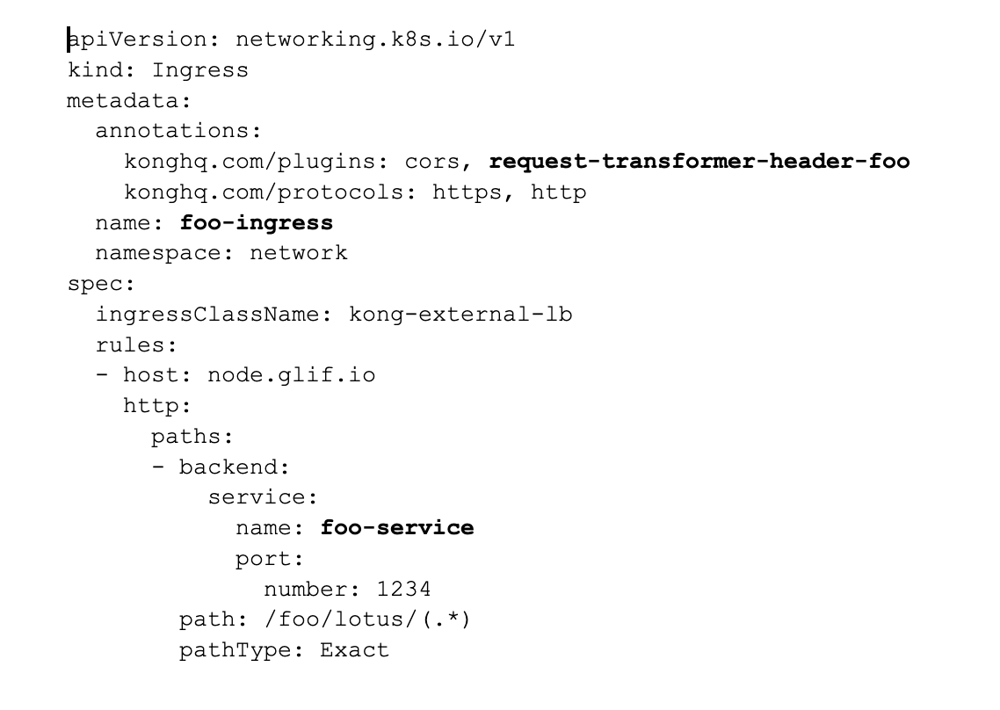
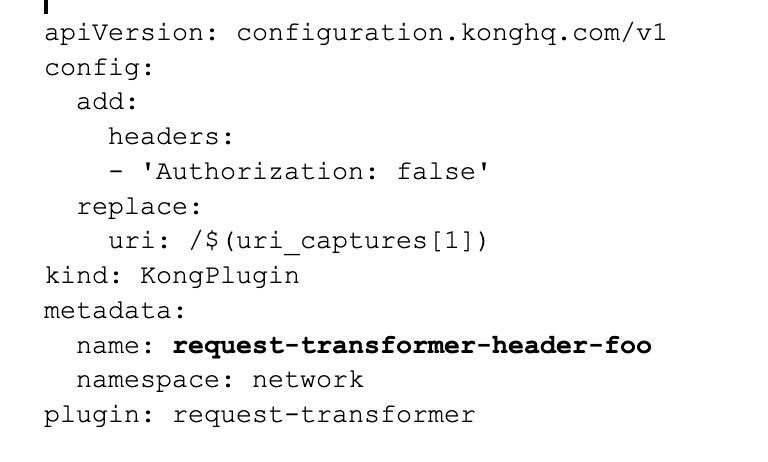
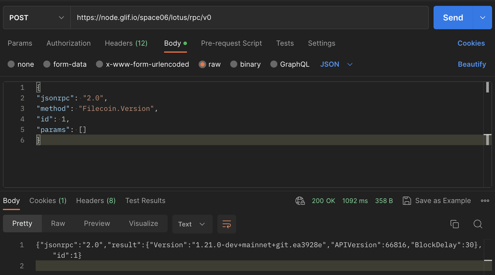

## Steps to switch traffic from one node to another


## Summary
Let’s assume we want to switch traffic from node **A** to node **B**. To do that, we must do the following:
1. [Edit the ingress rule]() of node A so the traffic flows to the service of node B.
2. [Edit the plugins]() enabled for the node A ingress so they apply the JWT authorization token of the node B for the incoming requests. That’s needed so the node B will not throw 401 Unauthorized status code on your requests signed with the node A authorization token because of the token mismatch.
So, let’s do that step by step based on the following example.


## Inputs
All the operations will be performed on the resources of the node A, so you only need to know the following about node B:
- <span style="color:black">bar-service</span> – that’s the service name of the node B.
- <span style="color:black">bar-token</span> – that’s the read-write authorization token. You can find it in the AWS Secrets Manager.

So, let’s describe the resources of node A that we’ll be working with

### Ingress
The ingress will look something like the following. Take note of the following thing:
- <span style="color:black">foo-ingress</span> – that’s the name of the ingress.
- <span style="color:black">request-transformer-header-foo</span> – that’s the KongPlugin resource that’s responsible for authorization.
- <span style="color:black">foo-service</span> – that’s the service that the ingress is pointing to.



### KongPlugin



## Switch the traffic
To actually switch the traffic, do the following steps:
1. <span style="color:black">Change the service field</span> of the node A ingress so it <span style="color:black">points to the bar-service</span>, like the following:

````shell
    kubectl -n network edit ingress foo-ingress
````

````yaml
apiVersion: networking.k8s.io/v1
kind: Ingress
metadata:
  annotations:
    konghq.com/plugins: cors, request-transformer-header-foo
    konghq.com/protocols: https, http
  name: foo-ingress
  namespace: network
spec:
  ingressClassName: kong-external-lb
  rules:
  - host: node.glif.io
    http:
      paths:
      - backend:
          service:
            name: bar-service
            port:
              number: 1234
        path: /foo/lotus/(.*)
        pathType: Exact
````

2. Edit the <span style="color:black">request-transformer-header-foo</span> KongPlugin so it adds and replaces the Authorization header of incoming requests to the <span style="color:black">Bearer bar-token</span>, like the following:

````shell

    kubectl -n network edit kongplugin request-transformer-header-foo
````

````yaml
apiVersion: configuration.konghq.com/v1
config:
  add:
    headers:
    - 'Authorization: Bearer bar-token’
  replace:
    uri: /$(uri_captures[1])
    headers:
    - 'Authorization: Bearer bar-token’
kind: KongPlugin
metadata:
  name: request-transformer-header-foo
  namespace: network
plugin: request-transformer

````

3. And that’s it! If everything has been done correctly, the requests you send to node A will actually flow to node B and will be signed by the correct authorization token.

The requests example:

````shell
curl -X POST 'https://node.glif.io/${NODE A}/lotus/rpc/v0' -H "Content-Type: application/json" --data '{"jsonrpc": "2.0", "method": "Filecoin.Version", "params": [], "id": 1}` -H "Authorization: Bearer bar-token"
````



