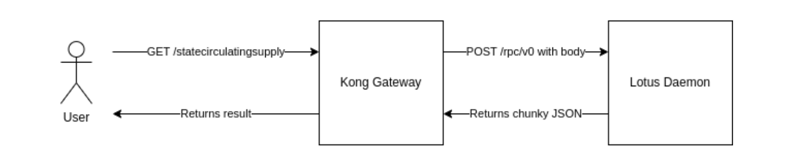

## Summary

This module provides resources to create ingress rules.

## Usage example
````
module "api_gateway_kong_hyperspace" {
count = local.is_prod_envs

source        = "../modules/api_gw_kong"
global_config = local.make_global_configuration

stage_name  = "hyperspace"
domain_name = "api.hyperspace.node.glif.io"

ingress_class    = "external"
namespace        = "network"
upstream_service = "hyperspace-lotus"
}
````


## Ingresses description


| Ingress name                  | HTTP method | HTTP PATH                           | Upstream service                    | Description                                                               |
|-------------------------------|-------------|-------------------------------------|-------------------------------------|---------------------------------------------------------------------------|
| post-root                     | `POST`      | `/`                                 | lotus_gateway                       | Defaults to `rpc/v1`.                                                     |
| options_root                  | `OPTIONS`   | `/`                                 | None                                | Returns status code 200 with body `'{"statusCode": 200}'`.                |
| get_root                      | `GET`       | `/`                                 | static page                         | 
| get-dilutedsupply             | `GET`       | `/dilutedsupply`                    | circulatingsupply-prod s3 bucket    | Leads to `"circulatingsupply-prod.s3.amazonaws.com/diluted_supply.html"`. |
| get-rpc-v0                    | `GET`       | `"/rpc/v0"`                         | static page                         | Leads to `/` path of the static page.                                     |
| options-rpc-v0                | `OPTIONS`   | `"/rpc/v0"`                         | None                                | returns status code 200 with body `'{"statusCode": 200}'`.                |
| post-rpc-v0                   | `POST`      | `"/rpc/v0"`                         | lotus_gateway                       |
| get-rpc-v1                    | `GET`       | `"/rpc/v1"`                         | static page                         | Leads to `/` path of the static page.                                     |
| options-rpc-v1                | `OPTIONS`   | `"/rpc/v1"`                         | None                                | Returns status code 200 with body `'{"statusCode": 200}'`.                |
| post-rpc-v1                   | `POST`      | `"/rpc/v1"`                         | lotus_gateway                       |
| get-circulating-supply        | `GET`       | `"/statecirculatingsupply"`         | lotus_daemon                        | Returns status code 200 with body  `'{"result:": "%d+" }'`.               |                           
| get-circulating-supply-fil    | `GET`       | `"/statecirculatingsupply/fil"`     | circulatingsupply-prod s3 bucket    | Leads to `"circulatingsupply-prod.s3.amazonaws.com/index.html"`.          |
| get-circulating-supply-fil-v2 | `GET`       | `"/statecirculatingsupply/fil/v2" ` | circulatingsupply-staging s3 bucket | Leads to `"circulatingsupply-staging.s3.amazonaws.com/index.html"`.       |
| get-vm-circulating-supply     | `GET`           | `"/vmcirculatingsupply" ` | lotus_daemon   | Returns status code 200 with body `{"FilCirculating":"%d+"'}`.            |


### GET /root

#### What happens there goes like the following:
- Kong receives a `GET` request for URL https://api.node.glif.io/.
- Kong looks for an ingress with:
  - http_host = `api.node.glif.io`
  - http_path = `/`
  - "konghq.com/methods" = `"GET"`
- On the access phase of the request processing Kong executes the [req_root.lua](scripts/req_root.lua) script. That implies the following:
  - Change the method to `POST`
  - Change the path to `/rpc/v1`
  - Add the Content-Type: `application/json` header
- Kong sends the altered request to the upstream service [static page](https://api.node.glif.io/).


### GET /statecirculatingsupply
The simplified execution process looks something like this:





#### What happens there goes like the following:
- Kong receives a `GET` request for URL https://api.node.glif.io/statecirculatingsupply.
- Kong looks for an ingress with:
  - http_host = `api.node.glif.io`
  - http_path = `/statecirculatingsupply `
  - "konghq.com/methods" = `"GET"`
- On the access phase of the request processing Kong executes the [req_statecirculatingsupply.lua](scripts/req_statecirculatingsupply.lua) script. That implies the following:
  - Change the method to `POST`
  - Change the path to `/rpc/v0`
  - Add the Content-Type: `application/json` header
  - Add the request body: `{"jsonrpc":"2.0","method":"Filecoin.StateCirculatingSupply","id":42,"params":[[]]}`
- Kong sends the altered request to the upstream service (lotus daemon).
- Kong receives a response from the upstream service (lotus daemon).This is a massive JSON
   - On the `headers_filter` phase of the request processing Kong deletes the Content-Length header from the response use [clear_content_lenght.lua](scripts/clear_content-length.lua) script.\
That’s important because we’re going to change the response text later and consequently the Content-Length header of the original response will become invalid.
   - On the `body_filter` phase of the request, processing Kong extracts the number from the result field of the original response using a [res_statecirculatingsupply.lua](scripts/res_statecirculatingsupply.lua) script and sets the response body to this number.\
Kong sends the altered response downstream.


### GET /vmcirculatingsupply
The simplified execution process looks something like this:

````mermaid
flowchart LR
    A["👨‍💼" \n User] -->|GET /vmcirculatingsupply| B(\n\n Kong Gateway\n\n\n)
    B --> | POST /rpc/v0 with body | C(\n\n Lotus daemon\n\n\n)
    C --> | Returns a massive JSON | B 
    B --> | Returns a result | A 
    
````
#### What happens there goes like the following:
- Kong receives a `GET` request for URL https://api.node.glif.io/statecirculatingsupply.
- Kong looks for an ingress with:
  - http_host = `api.node.glif.io`
  - http_path = `/vmcirculatingsupply`
  - "konghq.com/methods" = `"GET"`
- On the access phase of the request processing Kong executes the [req_vmcirculatingsupply.lua](scripts/req_vmcirculatingsupply.lua) script. That implies the following:
  - Change the method to `POST`
  - Change the path to `/rpc/v0`
  - Add the Content-Type: `application/json` header
  - Add the request body: `{"jsonrpc":"2.0","method":"Filecoin.StateVMCirculatingSupplyInternal","id":42,"params":[[]]}`
- Kong sends the altered request to the upstream service (lotus daemon).
- Kong receives a response from the upstream service (lotus daemon).This is a massive JSON
  - On the `headers_filter` phase of the request processing Kong deletes the Content-Length header from the response use [clear_content_lenght.lua](scripts/clear_content-length.lua) script.\
    That’s important because we’re going to change the response text later and consequently the Content-Length header of the original response will become invalid.
  - On the `body_filter` phase of the request, processing Kong extracts the number from the result field of the original response using a [res_vmcirculatingsupply.lua](scripts/res_vmcirculatingsupply.lua) script and sets the response body to this number.\
    Kong sends the altered response downstream.


## Providers

| Name | Version |
|------|---------|
| <a name="provider_aws"></a> [aws](#provider\_aws) | n/a |
| <a name="provider_kubernetes"></a> [kubernetes](#provider\_kubernetes) | n/a |

## Modules

| Name | Source | Version |
|------|--------|---------|
| <a name="module_generator"></a> [generator](#module\_generator) | ../../modules/generator | n/a |

## Resources

| Name | Type |
|------|------|
| [kubernetes_ingress_v1.get_circulating_supply](https://registry.terraform.io/providers/hashicorp/kubernetes/latest/docs/resources/ingress_v1) | resource |
| [kubernetes_ingress_v1.get_circulating_supply_fil](https://registry.terraform.io/providers/hashicorp/kubernetes/latest/docs/resources/ingress_v1) | resource |
| [kubernetes_ingress_v1.get_circulating_supply_fil_v2](https://registry.terraform.io/providers/hashicorp/kubernetes/latest/docs/resources/ingress_v1) | resource |
| [kubernetes_ingress_v1.get_diluted_supply](https://registry.terraform.io/providers/hashicorp/kubernetes/latest/docs/resources/ingress_v1) | resource |
| [kubernetes_ingress_v1.get_root](https://registry.terraform.io/providers/hashicorp/kubernetes/latest/docs/resources/ingress_v1) | resource |
| [kubernetes_ingress_v1.get_rpc_v0](https://registry.terraform.io/providers/hashicorp/kubernetes/latest/docs/resources/ingress_v1) | resource |
| [kubernetes_ingress_v1.get_rpc_v1](https://registry.terraform.io/providers/hashicorp/kubernetes/latest/docs/resources/ingress_v1) | resource |
| [kubernetes_ingress_v1.get_vm_circulating_supply](https://registry.terraform.io/providers/hashicorp/kubernetes/latest/docs/resources/ingress_v1) | resource |
| [kubernetes_ingress_v1.options_root](https://registry.terraform.io/providers/hashicorp/kubernetes/latest/docs/resources/ingress_v1) | resource |
| [kubernetes_ingress_v1.options_rpc_v0](https://registry.terraform.io/providers/hashicorp/kubernetes/latest/docs/resources/ingress_v1) | resource |
| [kubernetes_ingress_v1.options_rpc_v1](https://registry.terraform.io/providers/hashicorp/kubernetes/latest/docs/resources/ingress_v1) | resource |
| [kubernetes_ingress_v1.post_root](https://registry.terraform.io/providers/hashicorp/kubernetes/latest/docs/resources/ingress_v1) | resource |
| [kubernetes_ingress_v1.post_rpc_v0](https://registry.terraform.io/providers/hashicorp/kubernetes/latest/docs/resources/ingress_v1) | resource |
| [kubernetes_ingress_v1.post_rpc_v1](https://registry.terraform.io/providers/hashicorp/kubernetes/latest/docs/resources/ingress_v1) | resource |
| [kubernetes_ingress_v1.ssl-get_circulating_supply](https://registry.terraform.io/providers/hashicorp/kubernetes/latest/docs/resources/ingress_v1) | resource |
| [kubernetes_ingress_v1.ssl-get_circulating_supply_fil](https://registry.terraform.io/providers/hashicorp/kubernetes/latest/docs/resources/ingress_v1) | resource |
| [kubernetes_ingress_v1.ssl-get_circulating_supply_fil_v2](https://registry.terraform.io/providers/hashicorp/kubernetes/latest/docs/resources/ingress_v1) | resource |
| [kubernetes_ingress_v1.ssl-get_diluted_supply](https://registry.terraform.io/providers/hashicorp/kubernetes/latest/docs/resources/ingress_v1) | resource |
| [kubernetes_ingress_v1.ssl-get_root](https://registry.terraform.io/providers/hashicorp/kubernetes/latest/docs/resources/ingress_v1) | resource |
| [kubernetes_ingress_v1.ssl-get_rpc_v0](https://registry.terraform.io/providers/hashicorp/kubernetes/latest/docs/resources/ingress_v1) | resource |
| [kubernetes_ingress_v1.ssl-get_rpc_v1](https://registry.terraform.io/providers/hashicorp/kubernetes/latest/docs/resources/ingress_v1) | resource |
| [kubernetes_ingress_v1.ssl-get_vm_circulating_supply](https://registry.terraform.io/providers/hashicorp/kubernetes/latest/docs/resources/ingress_v1) | resource |
| [kubernetes_ingress_v1.ssl-options_root](https://registry.terraform.io/providers/hashicorp/kubernetes/latest/docs/resources/ingress_v1) | resource |
| [kubernetes_ingress_v1.ssl-options_rpc_v0](https://registry.terraform.io/providers/hashicorp/kubernetes/latest/docs/resources/ingress_v1) | resource |
| [kubernetes_ingress_v1.ssl-options_rpc_v1](https://registry.terraform.io/providers/hashicorp/kubernetes/latest/docs/resources/ingress_v1) | resource |
| [kubernetes_ingress_v1.ssl-post_root](https://registry.terraform.io/providers/hashicorp/kubernetes/latest/docs/resources/ingress_v1) | resource |
| [kubernetes_ingress_v1.ssl-post_rpc_v0](https://registry.terraform.io/providers/hashicorp/kubernetes/latest/docs/resources/ingress_v1) | resource |
| [kubernetes_ingress_v1.ssl-post_rpc_v1](https://registry.terraform.io/providers/hashicorp/kubernetes/latest/docs/resources/ingress_v1) | resource |
| [kubernetes_manifest.cors](https://registry.terraform.io/providers/hashicorp/kubernetes/latest/docs/resources/manifest) | resource |
| [kubernetes_manifest.http_mirror-rpc](https://registry.terraform.io/providers/hashicorp/kubernetes/latest/docs/resources/manifest) | resource |
| [kubernetes_manifest.request_transformer-daemon_access](https://registry.terraform.io/providers/hashicorp/kubernetes/latest/docs/resources/manifest) | resource |
| [kubernetes_manifest.request_transformer-public_access](https://registry.terraform.io/providers/hashicorp/kubernetes/latest/docs/resources/manifest) | resource |
| [kubernetes_manifest.request_transformer-to_diluted_supply](https://registry.terraform.io/providers/hashicorp/kubernetes/latest/docs/resources/manifest) | resource |
| [kubernetes_manifest.request_transformer-to_index](https://registry.terraform.io/providers/hashicorp/kubernetes/latest/docs/resources/manifest) | resource |
| [kubernetes_manifest.request_transformer-to_root](https://registry.terraform.io/providers/hashicorp/kubernetes/latest/docs/resources/manifest) | resource |
| [kubernetes_manifest.request_transformer-to_rpc_v0](https://registry.terraform.io/providers/hashicorp/kubernetes/latest/docs/resources/manifest) | resource |
| [kubernetes_manifest.request_transformer-to_rpc_v1](https://registry.terraform.io/providers/hashicorp/kubernetes/latest/docs/resources/manifest) | resource |
| [kubernetes_manifest.response_transformer-content_type](https://registry.terraform.io/providers/hashicorp/kubernetes/latest/docs/resources/manifest) | resource |
| [kubernetes_manifest.serverless_function-mock](https://registry.terraform.io/providers/hashicorp/kubernetes/latest/docs/resources/manifest) | resource |
| [kubernetes_manifest.serverless_function-root](https://registry.terraform.io/providers/hashicorp/kubernetes/latest/docs/resources/manifest) | resource |
| [kubernetes_manifest.serverless_function-statecirculatingsupply](https://registry.terraform.io/providers/hashicorp/kubernetes/latest/docs/resources/manifest) | resource |
| [kubernetes_manifest.serverless_function-vmcirculatingsupply](https://registry.terraform.io/providers/hashicorp/kubernetes/latest/docs/resources/manifest) | resource |
| [kubernetes_service.circulating_supply](https://registry.terraform.io/providers/hashicorp/kubernetes/latest/docs/resources/service) | resource |
| [kubernetes_service.circulating_supply_staging](https://registry.terraform.io/providers/hashicorp/kubernetes/latest/docs/resources/service) | resource |
| [kubernetes_service.homepage](https://registry.terraform.io/providers/hashicorp/kubernetes/latest/docs/resources/service) | resource |
| [aws_secretsmanager_secret.current](https://registry.terraform.io/providers/hashicorp/aws/latest/docs/data-sources/secretsmanager_secret) | data source |
| [aws_secretsmanager_secret.daemon](https://registry.terraform.io/providers/hashicorp/aws/latest/docs/data-sources/secretsmanager_secret) | data source |
| [aws_secretsmanager_secret_version.current](https://registry.terraform.io/providers/hashicorp/aws/latest/docs/data-sources/secretsmanager_secret_version) | data source |
| [aws_secretsmanager_secret_version.daemon](https://registry.terraform.io/providers/hashicorp/aws/latest/docs/data-sources/secretsmanager_secret_version) | data source |

## Inputs

| Name | Description | Type | Default | Required |
|------|-------------|------|---------|:--------:|
| <a name="input_affix_ingress_class"></a> [affix\_ingress\_class](#input\_affix\_ingress\_class) | If true, ingress class name is kong-name-lb | `bool` | `true` | no |
| <a name="input_affix_upstream_service"></a> [affix\_upstream\_service](#input\_affix\_upstream\_service) | If true, add -lotus at the end of upstream service name | `bool` | `false` | no |
| <a name="input_certificate_issuer"></a> [certificate\_issuer](#input\_certificate\_issuer) | If provided, use the certificate issuer for SSL | `string` | `""` | no |
| <a name="input_domain_name"></a> [domain\_name](#input\_domain\_name) | List of s3 buckets names. | `string` | n/a | yes |
| <a name="input_enable_mirroring"></a> [enable\_mirroring](#input\_enable\_mirroring) | n/a | `bool` | `false` | no |
| <a name="input_global_config"></a> [global\_config](#input\_global\_config) | n/a | `any` | n/a | yes |
| <a name="input_ingress_class"></a> [ingress\_class](#input\_ingress\_class) | Ingress class name. | `string` | n/a | yes |
| <a name="input_mirror_to"></a> [mirror\_to](#input\_mirror\_to) | n/a | `list` | `[]` | no |
| <a name="input_namespace"></a> [namespace](#input\_namespace) | n/a | `string` | n/a | yes |
| <a name="input_override_daemon_port"></a> [override\_daemon\_port](#input\_override\_daemon\_port) | n/a | `number` | `1234` | no |
| <a name="input_override_daemon_service"></a> [override\_daemon\_service](#input\_override\_daemon\_service) | n/a | `string` | `null` | no |
| <a name="input_override_rpc_v0_port"></a> [override\_rpc\_v0\_port](#input\_override\_rpc\_v0\_port) | n/a | `number` | `null` | no |
| <a name="input_override_rpc_v0_service"></a> [override\_rpc\_v0\_service](#input\_override\_rpc\_v0\_service) | n/a | `string` | `null` | no |
| <a name="input_override_rpc_v1_port"></a> [override\_rpc\_v1\_port](#input\_override\_rpc\_v1\_port) | n/a | `number` | `null` | no |
| <a name="input_override_rpc_v1_service"></a> [override\_rpc\_v1\_service](#input\_override\_rpc\_v1\_service) | n/a | `string` | `null` | no |
| <a name="input_stage_name"></a> [stage\_name](#input\_stage\_name) | If provided, use for the naming ingress. | `string` | n/a | yes |
| <a name="input_upstream_port"></a> [upstream\_port](#input\_upstream\_port) | Backend service port. | `number` | `2346` | no |
| <a name="input_upstream_service"></a> [upstream\_service](#input\_upstream\_service) | Backend service name. | `string` | n/a | yes |
