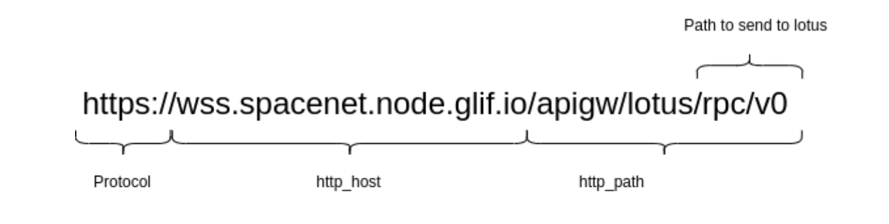

## Summary 

This module provides resources to create ingress rules.


## Configuration examples

- Set of variables to create a Private node:

````
enable_access_control = true
access_control_public = false (by default)
access_control_replace = false (by default)
enable_path_transformer = true (by default)
enable_return_json = true (by default)
enable_cors = true (by default)
````


- Set of variables to create a Public node:

````
enable_access_control = true
access_control_public = true
access_control_replace = false (by default)
enable_path_transformer = true (by default)
enable_return_json = true (by default)
enable_cors = true (by default)
````

- Set of variables to create a Non-lotus node:

````
enable_access_control = false (by default)
enable_path_transformer = false
enable_return_json = false
enable_cors = true (by default)
````


## Usage examples
Let’s assume the URL you’re requesting looks something like this:



Example of an ingress for such a URL will look something like this:

````
module "wss_spacenet_public" {
name   = "wss-spacenet-public"
source = "../modules/ovh_ingress"

namespace = "network"

http_host = "wss.spacenet.node.glif.io"
http_path = "/apigw/lotus/(.*)"

service_name = "spacenet-public-lotus-service"
service_port = 2346

secret_name = module.spacenet_secret.aws_secret_name

enable_access_control = true
access_control_public = true
}
````
Let’s describe what’s going on here in more detail.


### Variables description

**enable_path_transformer**

This variable is **true** by default.
If the variable is set to **false**, the ingress will send `/apigw/lotus/rpc/v0` (the whole path) to the Lotus gateway, and in response to that the Lotus gateway will throw `404 Not Found error` because it only supports the `/rpc/v0` and the `/rpc/v1` paths.\
To prevent that, set the enable_path_transformer variable to **true**. The ingress will transform the path so only the part of http_path marked as `(.*)` will be sent to the lotus gateway.


**enable_access_control**

This variable is **false** by default.
If this variable is set to **true**, requests through the ingress will be transformed in the following way:
- If access_control_public = false (the default value), add Authorization header with value false to the request.
- If access_control_public = true (the default value), add Authorization header with the valid JWT token from AWS Secrets Manager to the request.
- If access_control_replace = false (default value), add the Authorization header if it’s not provided by the user.
- If access_control_replace = true, replace the Authorization header even if it’s provided by the user.


**enable_return_json**

This variable is **true** by default.
- If the variable is set to true, add Content-Type: `application/json` header to the response.
  That’s useful because lotus gateway returns json in response, but the Content-Type header is set to plaintext by default.


**enable_cors**

This variable is **true** by default.
- If the variable is set to true, enable CORS policy.
  A CORS policy specifies the settings that can be applied to resources to allow Cross-Origin Resource Sharing.


**enable_letsencrypt**

This variable is **true** by default.
- Set this variable to true only in the OVH environment. That will tell the LetsEncrypt deployment to issue an SSL certificate for the ingress. In AWS we use AWS Certificate Manager to issue certificates, so set this variable to false in the AWS environment.


## Requirements

| Name | Version |
|------|---------|
| <a name="requirement_terraform"></a> [terraform](#requirement\_terraform) | 1.3.1 |
| <a name="requirement_aws"></a> [aws](#requirement\_aws) | 4.33.0 |
| <a name="requirement_helm"></a> [helm](#requirement\_helm) | 2.6.0 |
| <a name="requirement_kubernetes"></a> [kubernetes](#requirement\_kubernetes) | 2.13.1 |
| <a name="requirement_local"></a> [local](#requirement\_local) | 2.2.3 |
| <a name="requirement_ovh"></a> [ovh](#requirement\_ovh) | 0.30.0 |
| <a name="requirement_random"></a> [random](#requirement\_random) | 3.4.3 |
| <a name="requirement_tls"></a> [tls](#requirement\_tls) | 4.0.2 |

## Providers

| Name | Version |
|------|---------|
| <a name="provider_aws"></a> [aws](#provider\_aws) | 4.33.0 |
| <a name="provider_kubernetes"></a> [kubernetes](#provider\_kubernetes) | 2.13.1 |


## Resources

| Name | Type |
|------|------|
| [kubernetes_ingress_v1.default](https://registry.terraform.io/providers/hashicorp/kubernetes/2.13.1/docs/resources/ingress_v1) | resource |
| [kubernetes_ingress_v1.default_ssl](https://registry.terraform.io/providers/hashicorp/kubernetes/2.13.1/docs/resources/ingress_v1) | resource |
| [kubernetes_manifest.cors](https://registry.terraform.io/providers/hashicorp/kubernetes/2.13.1/docs/resources/manifest) | resource |
| [kubernetes_manifest.request_transformer-path_transformer](https://registry.terraform.io/providers/hashicorp/kubernetes/2.13.1/docs/resources/manifest) | resource |
| [kubernetes_manifest.request_transformer-path_transformer_private_access_add](https://registry.terraform.io/providers/hashicorp/kubernetes/2.13.1/docs/resources/manifest) | resource |
| [kubernetes_manifest.request_transformer-path_transformer_private_access_replace](https://registry.terraform.io/providers/hashicorp/kubernetes/2.13.1/docs/resources/manifest) | resource |
| [kubernetes_manifest.request_transformer-path_transformer_public_access_add](https://registry.terraform.io/providers/hashicorp/kubernetes/2.13.1/docs/resources/manifest) | resource |
| [kubernetes_manifest.request_transformer-path_transformer_public_access_replace](https://registry.terraform.io/providers/hashicorp/kubernetes/2.13.1/docs/resources/manifest) | resource |
| [kubernetes_manifest.request_transformer-private_access_add](https://registry.terraform.io/providers/hashicorp/kubernetes/2.13.1/docs/resources/manifest) | resource |
| [kubernetes_manifest.request_transformer-private_access_replace](https://registry.terraform.io/providers/hashicorp/kubernetes/2.13.1/docs/resources/manifest) | resource |
| [kubernetes_manifest.request_transformer-public_access_add](https://registry.terraform.io/providers/hashicorp/kubernetes/2.13.1/docs/resources/manifest) | resource |
| [kubernetes_manifest.request_transformer-public_access_replace](https://registry.terraform.io/providers/hashicorp/kubernetes/2.13.1/docs/resources/manifest) | resource |
| [kubernetes_manifest.response_transformer-return_json](https://registry.terraform.io/providers/hashicorp/kubernetes/2.13.1/docs/resources/manifest) | resource |
| [aws_secretsmanager_secret.default](https://registry.terraform.io/providers/hashicorp/aws/4.33.0/docs/data-sources/secretsmanager_secret) | data source |
| [aws_secretsmanager_secret_version.default](https://registry.terraform.io/providers/hashicorp/aws/4.33.0/docs/data-sources/secretsmanager_secret_version) | data source |

## Inputs

| Name | Description | Type | Default | Required |
|------|-------------|------|---------|:--------:|
| <a name="input_access_control_public"></a> [access\_control\_public](#input\_access\_control\_public) | If true, add/replace Authorization header with a valid JWT token. Otherwise, with the invalid one. | `bool` | `false` | no |
| <a name="input_access_control_replace"></a> [access\_control\_replace](#input\_access\_control\_replace) | If true, replace Authorization header on top of adding it if it's not present. | `bool` | `false` | no |
| <a name="input_auth_token_attribute"></a> [auth\_token\_attribute](#input\_auth\_token\_attribute) | Attribute of secret to exteact auth token from | `string` | `"jwt_token_kong_rw"` | no |
| <a name="input_certificate_issuer"></a> [certificate\_issuer](#input\_certificate\_issuer) | Certificate Manager issuer name | `string` | `"letsencrypt-issuer"` | no |
| <a name="input_enable_access_control"></a> [enable\_access\_control](#input\_enable\_access\_control) | Enable Authorization header add/replace | `bool` | `false` | no |
| <a name="input_enable_cors"></a> [enable\_cors](#input\_enable\_cors) | If true, enable CORS policy | `bool` | `true` | no |
| <a name="input_enable_letsencrypt"></a> [enable\_letsencrypt](#input\_enable\_letsencrypt) | Enable issuing certificate for the ingress through Letsencrypt | `bool` | `true` | no |
| <a name="input_enable_path_transformer"></a> [enable\_path\_transformer](#input\_enable\_path\_transformer) | If true, transform path as specified in replace\_path\_rule | `bool` | `true` | no |
| <a name="input_enable_return_json"></a> [enable\_return\_json](#input\_enable\_return\_json) | If true, add Content-Type: application/json header to response | `bool` | `true` | no |
| <a name="input_http_host"></a> [http\_host](#input\_http\_host) | HTTP host to match | `string` | n/a | yes |
| <a name="input_http_path"></a> [http\_path](#input\_http\_path) | HTTP path to match | `string` | `"/(.*)"` | no |
| <a name="input_http_path_type"></a> [http\_path\_type](#input\_http\_path\_type) | HTTP path comparison type | `string` | `"Exact"` | no |
| <a name="input_incress_class"></a> [incress\_class](#input\_incress\_class) | Ingress class name | `string` | `"default"` | no |
| <a name="input_name"></a> [name](#input\_name) | Ingress name | `string` | n/a | yes |
| <a name="input_namespace"></a> [namespace](#input\_namespace) | Namespace to create the ingress in | `string` | `"network"` | no |
| <a name="input_replace_path_rule"></a> [replace\_path\_rule](#input\_replace\_path\_rule) | Regular expression to transform the path | `string` | `"/$(uri_captures[1])"` | no |
| <a name="input_secret_name"></a> [secret\_name](#input\_secret\_name) | Secret name to get authorization token from | `string` | `null` | no |
| <a name="input_service_name"></a> [service\_name](#input\_service\_name) | Backend service name | `string` | n/a | yes |
| <a name="input_service_port"></a> [service\_port](#input\_service\_port) | Backend service port | `number` | n/a | yes |
